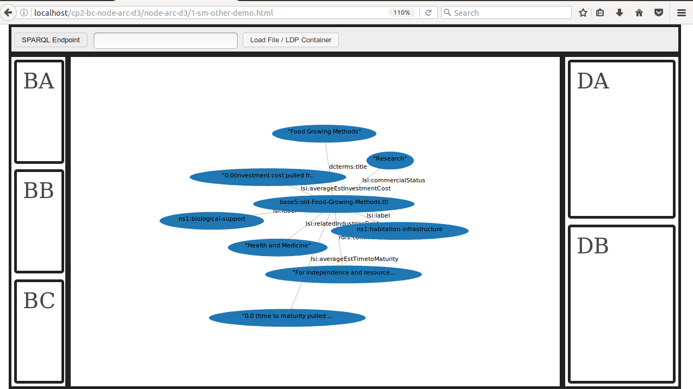
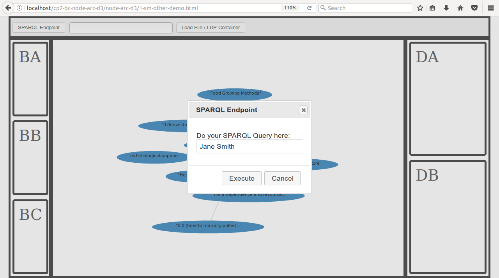

#Expressing RDF triples written in turtle as graph primatives (nodes,edges) fed to d3 force directed graph. Descendant of [map](https://github.com/bshambaugh/map/) and [node-arc-p5](https://github.com/bshambaugh/node-arc-p5).

<!--  -->
<!--  -->

Run this by dropping in /var/www/html or whatever your Apache web root is

Git Clone node-arc-d3 to a web folder (/var/www.html or whatever your Apache web root is) and install the node modules by follwing the steps:

(1) cd /var/www/html

(2) git clone https://github.com/bshambaugh/node-arc-d3

(3) cd node-arc-d3

(4) npm init

(5) npm install --save d3 jquery jsonld lodash n3 requirejs urijs jquery-ui

(6) In a web-browser serve from http://localhost/node-arc-d3/

<!--Replace the variable url with the path to your file in .

var url = 'http://localhost/node-arc-d3/data/test.nq'; -->

#Use: 

##How to load a file:

##How to load an LDP Container:

##How to perform a Sparql Query:

Supports Turtle, TriG, N-Triples, N-Quads, and Notation3 (N3) from  .
Also supports JSON-LD from  .

The Grid Layout Boxes (A, DA, DB, ..) are Supported by the Following Browsers: [http://gridbyexample.com/browsers/](http://gridbyexample.com/browsers/) .

# Program flowchart:

#Based off of [Force Directed Graph with D3.js](https://bl.ocks.org/mbostock/4062045).

# Goal:

In the near future with issue [#22](https://github.com/bshambaugh/node-arc-d3/issues/22) :

In the bit farther future with PowerAqua for Open QA using , [PowerAqua Backup Files](https://sourceforge.net/projects/poweraqua/files/), and local files stored at /var/lib/tomcat7/webapps/poweraqua . In focus: "Car Projects with Brent Shambaugh" text box, Query Button to the right, column on the far right, and graph in the center. Also the "Data Path or URI" text box, and Load Data Button (called the Load File / LDP Container button above). Ignore: Column on the left (not everything is implemented yet), Documents box (it is part of of M. Fernandez' Thesis), 

